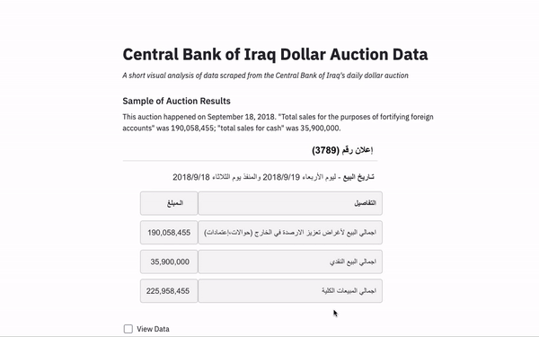

# CBI Project

  

I used Beautiful Soup to scrape down dollar auction data from the [Central Bank of Iraq](https://www.cbi.iq/)'s website, applied the Isolation Forest algorithm, and then visualized the results in Streamlit and Plotly. The goal is to see if there have been any noticeable changes in auction amounts over the past few years.

See writeup [here](https://medium.com/@mpokornyus/iranian-exploitation-of-iraqs-dollar-auction-3391af5032e0) detailing project context, scraping, and visualizations.

## Contents:

* data:
  * figures - screenshots of sample auction results and plotly visualizations.
  * raw - raw scraped data in CSV format.
  * processed - cleaned data in CSV format.
* notebooks:
  * cbi_viz - plotting auction amounts over time for the first writeup.
  * iforest_cbi - applying the Isolation Forest algorithm to the data and visualizing the results.
* python:
  * scraper_range1.py - script to scrape the first range of CBI data.
  * scraper_range2.py - script to scrape the second range of CBI data.
  * process.py - script to take the raw scraped data and output a cleaned dataframe.
  * streamlit_iforest.py - script that encompasses both the visualization and modeling from the notebooks in a Streamlit app.

## Setup
* Clone the repo.
* With `pwd` being the repo, run `pipenv install Pipfile` to set up the environment
* `pipenv shell` will activate the environment
* To launch the streamlit app, run `streamlit run python/streamlit_iforest_bokeh.py`

## Changelog

##### branch==branch_4 202007
###### Added
- .py file for streamlit with bokeh
- new notebook with bokeh
- new gif

##### branch==branch_3
###### Added
- Further language to the README

###### Changed
- Plots for better layout and export.
